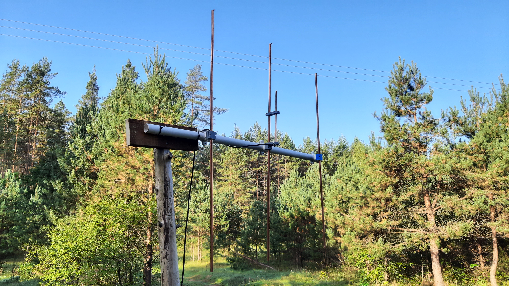
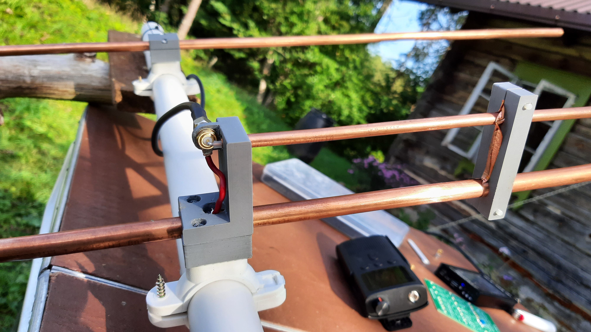
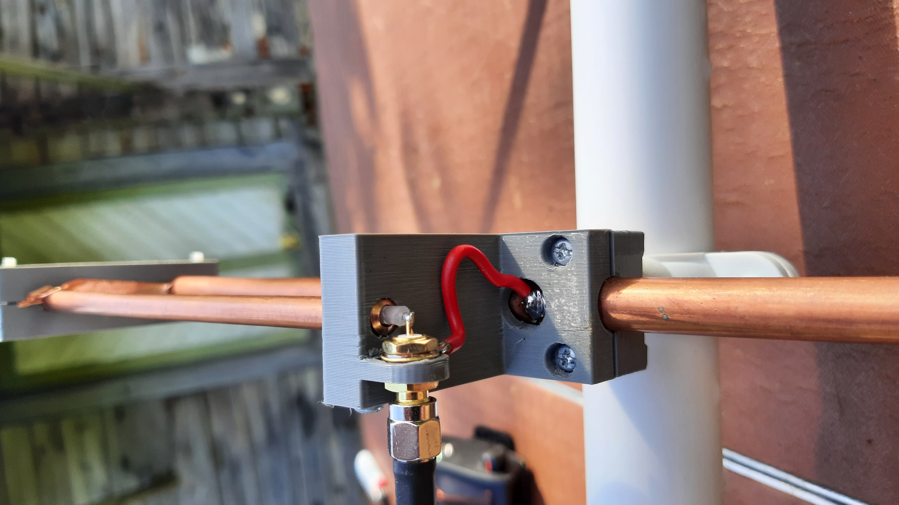

# VHF Yagi-Uda antenna

Antenna is designed to be mounted on a beam made of 1" sewer pipe using standard wall-mount attachments. 10mm copper tubing was used for radiating and parasitic elements, 6mm copper tube and internal part of RG58 cable was used for gamma match. Copper tubing was sourced from heating equipment vendors. Copper tape was used for shorting element of gamma match.

## Gamma match

Gamma match design is an amalgam of info gathered from the interwebs - namely distance from radiating element and thickness of gamma match element. Length of element was chosen experimentally - to allow enough of capacitance for tuning. RG58 cable was striped of internal insulation and shield and used inside 6mm tube.

## Element distances

Antenna will show low SWR with different element configurations depending on environment of antenna, for example elements had to be much closer when working "from hand" vs on 2m pole.

### Element distances on 2m pole

| Element   | Distance, mm |
|-----------|--------------|
| Reflector | 0            |
| Driven    | 334          |
| Director  | 725          |

Gamma match clamp at 131mm.

## Element lengths

[3 element Yagi calculator](https://www.rfwireless-world.com/calculators/3-element-Yagi-Antenna-Calculator.html) was used to determine lengths of elements using 145.7MHz center frequency. 

| Element   | Length, mm   |
|-----------|--------------|
| Reflector | 1020         |
| Driven    | 980          |
| Director  | 900          |
| Gamma rod | 200          |

## Tuning

[NanoVNA](https://nanovna.com) is critical for tuning process. Calibrate out your cable and monitor SWR on NanoVNA.

* Start with gamma match at max length
* Add reflector and driven element, adjust distance to achieve lowest SWR
* Add director, ajdust distance for lowers SWR
* Fine tune by adjusting gamma match shorting clamp

Note that antenna will have different distances between elements depending on surrounding environment of antenna. Try to achieve at least 2m separation from conductive surfaces and ground for optimal performance.